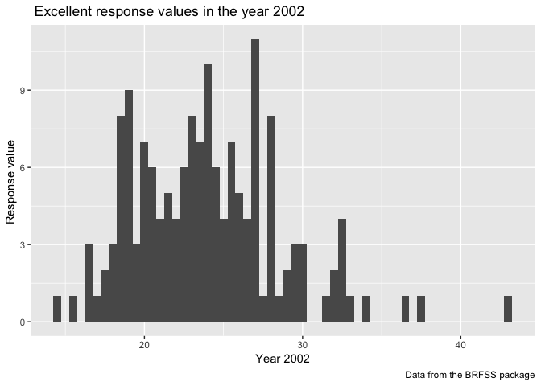
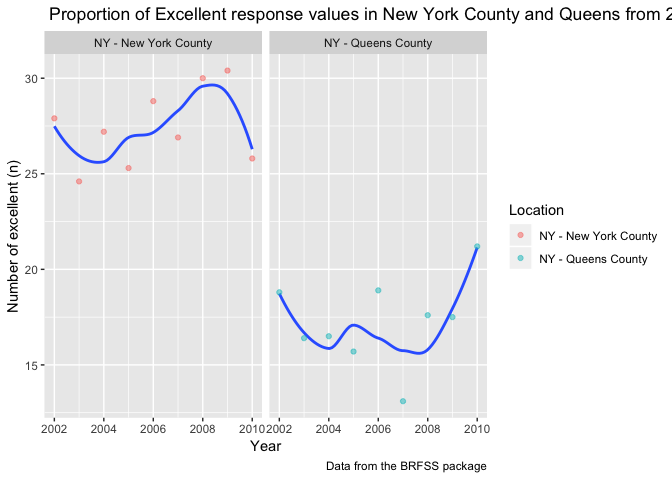

p8105\_hw2\_sj2921
================
Shan Jiang
10/3/2018

## Problem 1

  - import data from csv file and do some cleaning.

<!-- end list -->

``` r
library(tidyverse)
  
NYC_Transit <- 
    read_csv(file = "./dataset_import/NYC_Transit_Subway_Entrance_And_Exit_Data.csv")
    NYC_Transit <- janitor::clean_names(NYC_Transit)

## Retain line, station, name, station latitude / longitude, routes served, entry, vending, entrance type, and ADA compliance.

NYC_df <- select(NYC_Transit, line, station_name, station_latitude, station_longitude, route1:route11, entry, exit_only, vending, entrance_type, ada)
```

  - Convert the entry variable from character (YES vs NO) to a logical
    variable

<!-- end list -->

``` r
# The conversion to logical variable.
NYC_df$vending <- 
  ifelse(NYC_Transit$vending == "YES", TRUE, FALSE)
NYC_df$entry <- 
  ifelse(NYC_Transit$entry == "YES",TRUE, FALSE)
```

  - **Brief summary of data**: this dataset contains the basic
    information in NYC metro, includes the Subway line(street/avenue),
    station name, the latitude and longtitude of each station, and the
    routes existed. Besides, the subset also contains if there is entry
    or vending for each station, the type of entrance and if is
    compliant with Americans with Disabilities Act.

  - **Data cleaning steps**:

<!-- end list -->

1.  Import data from selected sheet;
2.  Use `Janitor:: clean names` as efficient way to clean variable
    names;
3.  Adopt the select to retain the variables in need. After doing this,
    the data is basically readable, however, it’s not clean enough.

<!-- end list -->

  - **Dimension**: there are 20 column as variables and 1868 rows as
    observations in the dataset.

## Question (Problem1.1):

``` r
# Distinct stations in the dataset as of 465;
stations <- nrow(distinct(NYC_df, line, station_name))

# stations are ADA compliant as of 84;
ADA_no <- NYC_df %>% 
   filter(NYC_df$ada == TRUE) %>%
   distinct(line, station_name) 


# The propotion of station entrances/exits without vending allow entrance is 3.94%
No_vd <- NYC_df %>% 
   filter(NYC_df$vending == FALSE) %>%
   filter(entry == TRUE) 
Percent <- (nrow(No_vd) / sum(NYC_df$entry))
```

1.  According to above, there are 465 distinct stations in NYC.
2.  Also, through filtering we can know that there are 84 stations which
    are ADA compliant.
3.  The proportion of station entrances/exits without vending allow
    entrance is 0.0393611.

<!-- end list -->

  - Reformat data as
NYC\_tidy\_data

<!-- end list -->

``` r
# Make wide data turn to long data, route number and route name are distinct variables.
NYC_tidy_data <- NYC_df %>% 
    gather(key = route_name, value = route_number, 5:15) 

# 60 distinct stations serve the A train
route_A <- 
  NYC_tidy_data %>%
  distinct(line, station_name, station_name,.keep_all = TRUE) %>% 
  filter(route_number == "A") 

# Of the stations that serve the A train, 17 are ADA compliant
ADA_compliant <- NYC_tidy_data %>%
  filter(route_number == "A") %>% 
  distinct(line, station_name, station_name,.keep_all = TRUE)%>% 
  filter(ada == TRUE) 
```

1.  60 distinct stations serve the A train;
2.  Of the stations that serve the A train, 17 are ADA compliant.

## Problem 2

  - Read and clean the Mr. Trash Wheel sheet:

<!-- end list -->

``` r
# Load the sheet and specify the range to omit the notes.
library(tidyverse)
library(readxl)
trw_df <- readxl::read_excel(path =   "./dataset_import/HealthyHarborWaterWheelTotals2018-7-28.xlsx",sheet = 1, range = "A2:N338")

# Clean variable names 
trw_df <- janitor::clean_names(trw_df)

# omit rows that do not include dumpster-specific data
trw_df <- trw_df %>% 
  filter(trw_df$dumpster != "NA") 

# rounds the number of sports balls to the nearest integer and converts the result to an integer variable (using as.integer)
trw_df$`sports_balls` <- 
  as.integer(round(trw_df$`sports_balls`, digits = 0))

#calculate the total weight of gabbages in the year of 2017
weight_17 <- trw_df %>% 
  filter(year != 2017) 
  
sum_weight <- sum(weight_17$weight_tons)
```

  - import precipitation data in 2016 &
2017

<!-- end list -->

``` r
# Read 2017 precipitation data, clean names of variable, add a variable as year 2017
Precp_17 <- 
  readxl::read_excel(path =   "./dataset_import/HealthyHarborWaterWheelTotals2018-7-28.xlsx",sheet = 4, skip = 1) %>% 
  janitor::clean_names() %>% 
  filter(total != "NA", month != "NA") %>% 
  mutate(year = 2017)


# Read 2016 precipitation data, clean names of variable, add a variable as year 2016
Precp_16 <- readxl::read_excel(path =   "./dataset_import/HealthyHarborWaterWheelTotals2017-9-26.xlsx",sheet = 5, skip = 1 ) %>% 
  janitor::clean_names() %>% 
  filter(total != "NA", month != "NA") %>% 
  mutate(year = 2016)

## combine datasets and rename the variable:
Precp <- right_join(Precp_17, Precp_16, by = "month") 
  
names(Precp)[3] <- "Year1"  
names(Precp)[5] <- "Year2" 

names(Precp)[2] <- "Precipitation1"
names(Precp)[4] <- "Precipitation2"

# convert month to a character variable (the variable month.name is built into R and should be useful).
Precp$month <- as.character(month.name[Precp$month])

# Combine the new data frame organized.
Precp_df <- 
  Precp %>% 
  select(month, Year1, Precipitation1, Year2, Precipitation2) 

# calculate the total precipitation in 2017
sum_17_precp <- sum(Precp_df$Precipitation1, na.rm = TRUE)

# calculate the median of sportsballs in 2016
Ball_02 <- trw_df %>% 
    filter(year == 2016) 

med_sports <- median(Ball_02$`sports_balls`)

# Mean of Plastic bottles collected in 2017. 
sum_trw <- 
  trw_df %>% 
     filter(year == 2017)  

mean_plastic <- mean(sum_trw$plastic_bottles)
mean_plastic <- round(mean_plastic, digits = 0)

# sum of cigarette butts in the total period.
sum_cig <- sum(trw_df$cigarette_butts, na.rm = TRUE)
```

## key variables

  - The number of observations in 2016 is precpitation data 12;
  - The number of observations in 2017 precpitation data is 12;
  - The total precipitation in 2017 is 32.93;
  - The the median of sportsballs in 2016 is 26.
  - The total weight of dumpster in 2017 is 760.1;
  - The mean of glass bottles in 2017 is 1998.
  - The sum of cigrette butts for the last five years are 1.0289610^{7}.

## \# Problem 3

``` r
library(p8105.datasets)

# Import the BFRSS data, exclude variables and format the data by using appropriate names.
brfss_df <- 
  brfss_smart2010 %>% 
    janitor::clean_names() %>% 
    select(-class, -topic, -question, -sample_size, -confidence_limit_low:-geo_location ) 

# structure data: Response indicating the proportion of subjects with each response
Percentage <- 
  brfss_df  %>%
  filter(response == "Excellent"  | response == "Very good" | response == "Good" | response == "Fair" | response == "Poor") %>% 
  spread(key = response, value = data_value) %>% 
  janitor::clean_names() %>% 
# create a new variable showing the proportion of responses that were “Excellent” or “Very Good”
  mutate(Ex_good = excellent + very_good) 

# unique locations: Every state is represented in the dataset as there are 51 distinct states in the dataframe.
brfss_df %>% 
   distinct(., locationabbr, .keep_all = TRUE)
```

    ## # A tibble: 51 x 5
    ##     year locationabbr locationdesc              response  data_value
    ##    <int> <chr>        <chr>                     <chr>          <dbl>
    ##  1  2010 AL           AL - Jefferson County     Excellent       18.9
    ##  2  2010 AZ           AZ - Maricopa County      Excellent       27.3
    ##  3  2010 AR           AR - Benton County        Excellent       23.1
    ##  4  2010 CA           CA - Alameda County       Excellent       24  
    ##  5  2010 CO           CO - Adams County         No              92.2
    ##  6  2010 CT           CT - Fairfield County     Excellent       29.5
    ##  7  2010 DE           DE - Kent County          Excellent       18.2
    ##  8  2010 DC           DC - District of Columbia Excellent       26.1
    ##  9  2010 FL           FL - Alachua County       Excellent       29.3
    ## 10  2010 GA           GA - Cobb County          Yes              0.7
    ## # ... with 41 more rows

``` r
# The most observed one in the dataframe is FL.
brfss_df %>% 
  group_by(locationabbr) %>% 
  summarize(n = n()) 
```

    ## # A tibble: 51 x 2
    ##    locationabbr     n
    ##    <chr>        <int>
    ##  1 AK             664
    ##  2 AL            1164
    ##  3 AR            1351
    ##  4 AZ            2013
    ##  5 CA            3433
    ##  6 CO            3733
    ##  7 CT            2861
    ##  8 DC             556
    ##  9 DE            1668
    ## 10 FL            7978
    ## # ... with 41 more rows

``` r
# In 2002, what is the median of the “Excellent” response value
  excellent <- brfss_df %>% 
  filter(response == "Excellent" & year == "2002") 
```

## Graph for the BFRSS dataset

``` r
## Histrogram of Excellent Response in the Year of 2002
Percentage  %>%
  filter(year == "2002") %>% 
  ggplot(aes(x = excellent)) + 
  geom_histogram(binwidth = 0.5 ) + 
  labs(title = " Excellent response values in the year 2002",
       x = "Year 2002",
       y = "Response value ",
       caption = "Data from the BRFSS package"
       ) +
  theme(legend.position = "bottom")
```

    ## Warning: Removed 2 rows containing non-finite values (stat_bin).

<!-- -->

``` r
ggsave("histogram in 2002.png")
```

    ## Saving 7 x 5 in image

    ## Warning: Removed 2 rows containing non-finite values (stat_bin).

``` r
## Response as of excellent from year 2002 to 2010
Percentage  %>%
    filter(locationdesc == "NY - New York County" | locationdesc == "NY - Queens County") %>%
    ggplot(aes(x = year, y = excellent)) + 
    geom_smooth(se = FALSE) +
    geom_point(aes(color = locationdesc), alpha = .5) +
  labs(
    title = " Proportion of Excellent response values in New York County and Queens from 2002 to 2010",
    x = "Year",
    y = "Number of excellent (n)",
    caption = "Data from the BRFSS package"
  ) + 
    scale_color_hue(name = "Location", 
                 ) +
  facet_grid(. ~locationdesc)
```

    ## `geom_smooth()` using method = 'loess' and formula 'y ~ x'

<!-- -->

``` r
ggsave("proportion.pdf")
```

    ## Saving 7 x 5 in image

    ## `geom_smooth()` using method = 'loess' and formula 'y ~ x'

  - In the scatter plot, we can see that the NY-New York County gets
    more excellent response from the 2002 to 2010 than that of the
    NY-Queens County as the NY-New York County has a mean of `{}`

\`\`\`
